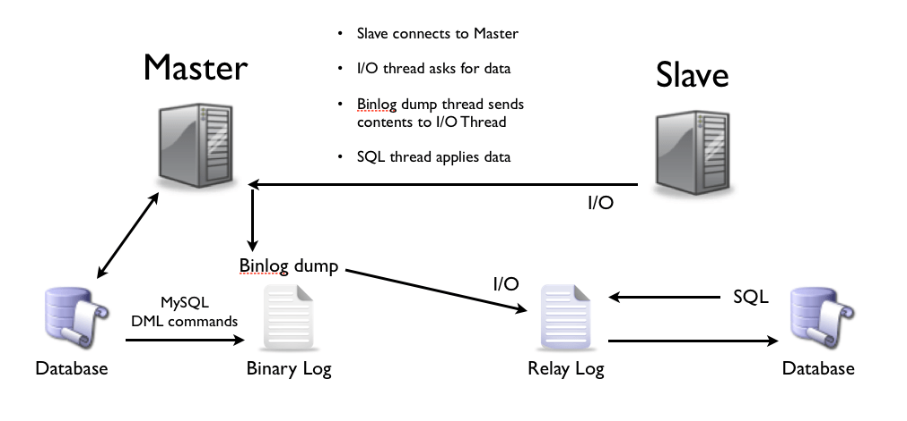

# LINUX

Dobar pocetak ako si [extrovert](https://www.youtube.com/watch?v=VbEx7B_PTOE&list=PLIhvC56v63IJIujb5cyE13oLuyORZpdkL)

Dobar pocetak ako si [introvert](https://www.youtube.com/@LearnLinuxTV)

# Docker

Uvijek [sluzbena dokumentacija](https://docs.docker.com/)

Sve sto treba za docker:
[Docker cheat sheet](https://it-cheat-sheets-21aa0a.gitlab.io/docker-cheat-sheet.html)

Napraviti account na [Docker hubu](https://hub.docker.com)

# MySQL

Uvijek [suzbena dokumentacija](https://dev.mysql.com/doc/)

Veoma dobar [cheat sheet](https://it-cheat-sheets-21aa0a.gitlab.io/sql-cheat-sheet.html)

Knjiga za procitati [High perfomance](https://learning.oreilly.com/library/viwe/high-perfomance-mysql/9781492080503/)

Jedon od boljih AI ([Amazing Indian](https://www.youtube.com/@hercules7sakthi/videos)) za ucenje Mysql

Rick RoTs [Rules of Thumb](https://mysql.rjweb.org/doc.php/ricksrots) ilitiga nauceno iz iskustva(drugih ljudi ne mene)

### Vjezba: Replication in MySQL [tutorial](https://www.digitalocean.com/community/tutorials/how-to-set-up-replication-in-mysql)

1. Pravimo [Docker Compose YAML](./images/MasterSlaveyaml.pngMasterSlaveyaml.png)  file(tu sam skontao da je dobra praksa da ime servisa i kontenjera bude isto)
2. Pravimo konfiguracijske fileove [master.conf](./images/masterconf.png) [slave.conf](./images/slaveconf.png)
3. Pokrenemo pomocu docker-composea oba kontenjera
4. Udjemo u master kontenjer i u mysql te kreiramo usera za replikaciju:

        CREATE USER 'replica_user'@'%' IDENTIFIED WITH mysql_native_password BY '123';

        GRANT REPLICATION SLAVE ON *.* TO 'replica_user'@'%';

        FLUSH PRIVILEGES;

5. Sada nadjemo zadnji unos u binary logu, i odatle ce poceti replikacija, ako je baza ziva radimo ove korake, sve to i dalje na masteru:

        FLUSH TABLES WITH READ LOCK;

        SHOW MASTER STATUS;

6. Vidimo koji je zadnji unos u binlogu i zapisemo.

7. Spojimo se na slave kontenjer i tamo uradimo:

        CHANGE REPLICATION SOURCE TO

        SOURCE_HOST='master',

        SOURCE_USER='replica_user',

        SOURCE_PASSWORD='123',

        SOURCE_LOG_FILE='mysql-bin.000001',

        SOURCE_LOG_POS=899;

        SOURCE_DELAY = 3600;

7.1

         START REPLICA;

         SHOW REPLICA STATUS\G;

8.  Ako neki binlog zapis se ne applya na slavea i tu zapne replikacija mozemo je preskociti sa dole navedenom komandom:

        STOP REPLICA;

        SET GLOBAL SQL_SLAVE_SKIP_COUNTER = 1; 

        START REPLICA;

9. Za zaustavljane replikacije koristimo

        STOP REPLICA;

# MONGODB

Uvijek [sluzbena dokumentacija](https://www.mongodb.com/docs/)

Offical [self managed path](https://learn.mongodb.com/learn/learning-path/mongodb-database-admin-self-managed-path) to scratch the surface

Unoffical [path](https://www.youtube.com/watch?v=cLsawKBUdTE&list=PLSmSa8KVdfSu-XFvjdWoN7z9WRoLly4my)

### Vjezba0: REPLICA SET S 3 MONGODB NODA 

1. Prvo pisemo [docker-compose.yaml](./images/mongo.png) file
2. Pravimo foldere za conf fileove koje cemo mountati kroz yaml i dodajemo u njih sta nam treba  -->  [mongo1.cnf](./images/mongoconf.png) mongo2.cnf mongo3.cnf (2 i 3 su isto kao 1)
3. Pravimo foldere za datu koju cemo mountati kroz yaml  --> data1_mongo  data2_mongo data3_mongo  (mkdir) // on ce i sam napraiviti foldere al nece imati permisije zato ih ja odmah napravim
4. Pravimo foldere za logove koje cemo mountati kroz yaml --> log1 log2 log3  (mkdir)  
5. Dajemo im permisije za pisanje i vlasnistvo nad data i log folderima da to mongo instanca moze i raditi iz dockera  (chown, chmod) \\ davao sam za chmod 777 da mi sigurno radi al u praksi ne treba tako
6. Posto smo u conf enable security moramo sada napraviti key file i mountati ga premo yaml file u kontenjer za svaki node  /etc/mongodb-keyfile

        openssl rand -base64 756 > ./mongodb-keyfile  \\ ne znam sada gdje ga drzimo ja sam ga ostavio u ovom folderu
        chmod 0400 /etc/mongo-keyfile   \\ moramo mu dati permisije samo za citanje inace ga mongo instanca nece prihvatiti
        chown -R 999:999 /etc/mongo-keyfile

7. Sve dobro provjeriti i vidjetli u yaml file jesu li imena i fileovi dobro mountani \\ posebno zbog cestih typo
8. Pomocu docker-compose dici sve 3 instance(!obavezno jednu po jednu!)
9. Spojiti se na jednu i inicializirati replica set:

        rs.initiate(
        {
        _id: "rs0",  // id replica seta
        version: 1,
        members: [
                 { _id: 0, host : "mongors1:27017" },
                 { _id: 1, host : "mongors2:27017" },
                 { _id: 2, host : "mongors3:27017" }         ] } )

10. Upotrijebiti admin database i dodati usera:

        use admin
        db.createUser( { user: "admin", pwd: "ass", roles: [{ role: "root", db: "admin" }] })

11. Opet se logirati i provjeriti status replica seta:

        rs.status()

12. Ako je sve uredu mozemo odraditi mini vjezbu manualnog mijenjaja primarya,na primarnom nodu upisemo:

        cfg = rs.conf()   // Trenutna konfiguracija replica seta
        cfg.members[2].priority = 2  //stavimo mu veci prioriti tako znamo da ce on biti izabran
        rs.reconfig(cfg)  // primjenjuje novu konfiguraciju
        rs.stepDown(60)  // automatski mu je 60 sekundi ali stavimo svakako

13. Sada ce replica izabrati node s _id 2 da bude primarni posto smo njemu dali veci prioritet.

### Vjezba1: Dodavanje hidden noda u replika set

Hidden nam sluzi da radimo backupe ili analitiku preko njega da ne bi opterecivali ostale nodove.
1. Prvo ga dodamo u [docker-compose.yaml](./images/mongohidden.png)
2. Napravimo i za njega [mongoh.conf](./images/mongoconf.png) koji cemo mountati kroz yaml
3. Napravimo foldere za datu i log fileove koje cemo mountati u yamlu s permisijama --> mongohidden_data  loghidden \\ dati permisije i vlasnistva
4. I njemu moramo mountati key file(procedura opisana u prijasnjoj vjezbi) 
5. Dignemo ga pomocu docker-composea
6. Spojimo se na primary instancu i pridruzimo ga replica setu

        rs.add({
        host: "mongohidden:27017",  // njegova adresa
        hidden: true,               // da je skriven
        priority: 0,                // da ne moze biti izabran za primarnog
        votes: 0,                   // da ne moze glasati
        secondaryDelaySecs: 3600    // da pise podatke s zaostatkom od 1h, ako se slucajno pobrise nesto s primarnog da mozemo brze vratiti podatke 
        })

7. Provjeriti status, njemu bi trebalo pisati hidden: true

### Vjezba2: DODAVANJE ARBITER NODA U REPLICA SET [link](https://www.mongodb.com/docs/manual/tutorial/add-replica-set-arbiter/)

 Arbiter nam sluzi u slucaju parnog broja nodova da bude dodatni glas kojim se moze izabrati primarni (najcesci slucaj je 2 noda + arbiter)

1. Prvo ga dodamo u [docker-compose.yaml](./images/mongoarbiter.png) file
2. Njemu ne treba folder za datu, mozemo napraviti samo za logove --> logarbiter // i dati mu permisije i vlasnistva
3. Napraviti i [mongoarb.conf](./images/mongoarbiterconf.png) file za njega, mozemo komentirati sve vezano za podatke a ostaviti postavke za replikaciju, i mountati ga u yamlu
4. I njemu se mora mountati key file 
5. Dizemo ga pomocu docker-composea
6. Pridruzimo ga replica setu s primarnog noda

        rs.addArb({"mongoarb:27017"})  //on vec u komandi addArb
7. Sada mozemo provjeriti stanje:

        rs.status()

### Vjezba3: BACKUP S MONGODUMP [link](https://www.mongodb.com/docs/database-tools/mongodump/)

1. Pravimo novi kontenjer 'mongobackup' s istom slikom kao i nodovi na kojima ce raditi backup --> [docker-compose.yaml](./images/mongoabackup.png) // nisam nasao sliku s mongo tools samo za alate, lakse mi je bilo staviti sliku cijelog monga
2. Mountamo novi folder gdje cemo cuvati backupe --> backups 
3. U enviromentu dadnemo novog usera za pravljenje backupa
4. Dignemo novi kontenjer pomocu docker-compose i spojimo se na njega
5. Moramo napraviti usera i na replici setu da se moze raditi backup, tako da se spojimo na primarnu instancu i kreiramo ga:

        db.createUser(
        {
        user: "BackupUser",  // bio sam lijen da stavim da se zove BackupRestoreUser tako da je ostao samo Backup
        pwd: "123", // 
        roles: [ { role: "backup", db: "admin" } ,
                { role: "restore", db: "admin" } ]
        }
        )

6. Na bash liniji u kontenjeru za backup kucamo:

        mongodump --host=mongors2:27017 --username=BackupUser --password=123  --authenticationDatabase admin -readPreference=secondary --oplog --gzip --archive=/var/backups

7. I imamo dump svih baza

### Vjezba4: RESTORE S MONGORESTORE [link](https://www.mongodb.com/docs/manual/tutorial/restore-replica-set-from-backup/)

1. Prvo spustimo sva tri noda posto cemo raditi "novi replica set"       // ovo necemo raditi kada je produkcijsko okruzenje vec dizemo sasvim novi replica set
2. Pobrisemo svu datu iz sva tri noda
3. Dignemo jedan node i na njemu uradimo inicijalizciju i dodavanje usera

        rs.initiate(
        {
        _id: "rs0",
        members: [
                { _id: 0, host : "mongors1:27017" } ] } )

        use admin
        db.createUser(
        {
        user: "BackupUser",                                      
        pwd: "123", // 
        roles: [ { role: "backup", db: "admin" } ,
                { role: "restore", db: "admin" } ]
        }
        )         

4. Iz kontenjera 'mongobackup' na bash liniji kucamo:

        mongorestore --archive=/var/backups/mongodump-2025-05-26.archive --gzip --host=mongors1:27017 -u BackupUser -p 123 --authenticationDatabase=admin 
5. Provjerimo jesu li podaci tu na prvom nodu al prvo se logiramo sa nasim userom.

        show dbs

6. Ako jesu dizemo i druga dva noda pomocu docker-compose
7. I dodajemo ih u replika set

        rs.add('mongors2:27017')
        rs.add('mongors3:27017')

### Vjezba5: RESTORE PITR [link](https://stackoverflow.com/questions/15444920/modify-and-replay-mongodb-oplog/15451297#15451297):

1. Scenario: U bazi smo napravili danas neku novu kolekciju i jos nesto radili, i sad slucajno pobrisemo neku staru kolekciju jer je bila slicnog imena.
2. Moramo imati backup s oplogom i on mora sadrzavati zajednicku tocku s novim oplogom, znaci scoop oploga mora uhvatiti i backupov
3. Uradimo dump oploga iz backup kontenjera:

        mongodump --host=mongors2:27017 --username=BackupUser --password=123   --authenticationDatabase admin -d local -c oplog.rs -o oplogD

4. Premjestimo oplog u novi direktorij

        mv oplogD/local/oplog.rs.bson oplogR/oplog.bson

5. Sada mozemo procitati oplog file pomocu bsondump ili naci u bazi ako je jos imamo timestamp kada je dropana kolekcija
6. Posto u mene jos je ziva mongo instanca provjeravam pomocu

        db.oplog.rs.find({
        "op": "c",
        "o.drop": { "$exists": true } // Provjerava da li postoji polje 'drop' unutar 'o' objekta
        }).sort({
        "ts": -1 // Sortiraj po timestampu (najnoviji prvi)
        })

7. Nalazim timestamp 1749562420, i: 1 
8. Sada opet radimo zadnji restore backupa koji imamo i sav proces
9. Onda radimo restore iz oploga:

        mongorestore --host=mongors1:27017 -u BackupUser -p 123 --authenticationDatabase=admin --oplogReplay --oplogLimit 1749562420:1 oplogR

10. Trebali bi sada imati vracenu kolekciju

### Vjezba6: BACKUP SA SKRIPTOM

1. Pravimo svoju [Dockerfile](./images/mongodockerfile.png) sliku 
2. U [docker-compose.yaml](./images/mongobackupskripta.png) pravimo novi servis sa svojom Docker slikom
3. Pravimo [skriptu](./images/mongodoskripta.png) za backup
4. Sada bi se trebao backup praviti jednom dnevno u 02:00h

### Dodatni materijali

Tinova [skripta](./images/function%20getRandomInt.txt) za unos vise podataka odjednom 
